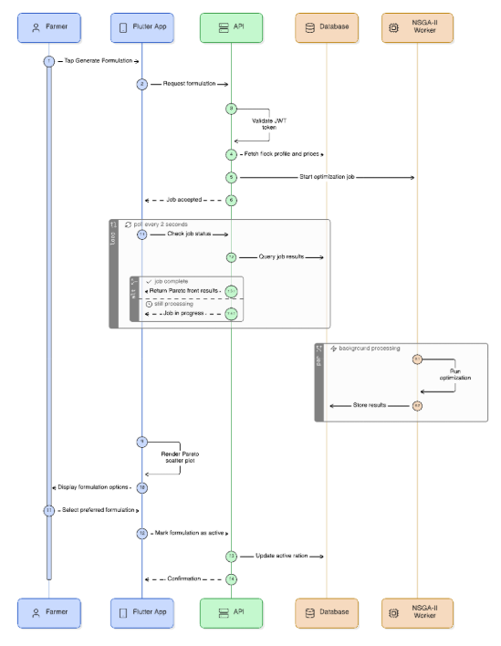
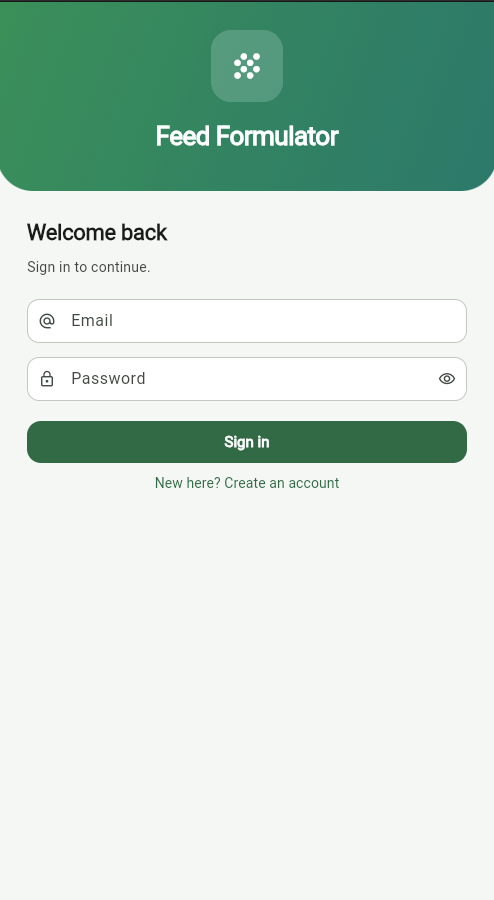
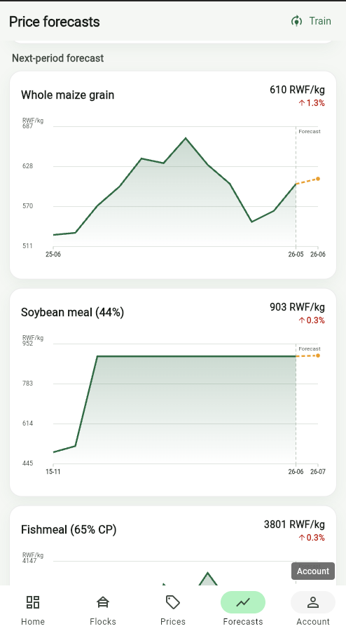

# poultry-feed-formulation

A cross-platform system that applies the Non-dominated Sorting Genetic Algorithm II (NSGA-II) to dynamically formulate least-cost poultry rations, optimising two conflicting objectives at once: total ration cost per kg and dietary transition variance (DTSI) relative to the previous production cycle, under market prices volatility conditions.

**API docs:** [http://portstead.com:8000/docs](http://portstead.com:8000/docs)

**Android APK:** [feed_formulation-debug.apk](./apk/feed_formulation-debug.apk)

**Video Demo URL:** [https://www.bugufi.link/8z-tu2](https://www.bugufi.link/8z-tu2)

## Architecture

The application is structured as a decoupled client-server architecture:



1. [**`Backend`**](./backend/README.md): A FastAPI web service orchestrating database queries, running the SciPy Linear Programming (LP) baseline, executing the NSGA-II genetic algorithm, and managing the Scikit-learn Gradient Boosting price forecaster.
2. [**`Mobile`**](./mobile/README.md): A Flutter application that allows users to manage flocks, input local market prices, execute optimization runs, visualize price trajectories, and analyze cost vs. diet stability trade-offs.

## ML and Optimization Pipeline

### 1. Price Forecasting

The system trains a pooled gradient boosting regressor on historical return series derived from the World Food Programme retail and wholesale dataset for Rwanda.
*   **Target**: One-month-ahead log-returns of domestically traded commodities (`Maize`, `Cassava`, `Salt`, `Oil (palm)`, and `Fish (dry)`).
*   **Price Inputs**: Imported ingredients (such as vitamin premixes and amino acids) without local pricing histories are priced via parity and entered manually.
*   **Validation**: Evaluated using walk-forward out-of-sample backtesting against naive random walk and seasonal naive benchmarks.

### 2. Multi-Objective Feed Formulation

Feed formulation is traditionally solved via Linear Programming (LP) to find the absolute least-cost vertex that meets nutritional constraints. However, small price movements in LP cause drastic shifts in recipe components, which can stress poultry digestive systems.

To solve this, the system uses NSGA-II (Non-dominated Sorting Genetic Algorithm II) to optimize two conflicting objectives:
1.  **Cost Minimization**: Minimizing the overall cost per kilogram of feed based on forecasted prices.
2.  **Diet Transition Stability Index (DTSI)**: Minimizing the cosine distance of the new formulation's ingredient vector relative to the flock's currently selected formulation.

## Setup

To spin up the entire application stack, refer to the setup steps in the sub-project directories:

*   For database migrations, model seeding, and API configurations, see the [Backend Setup Guide](./backend/README.md).
*   For running the mobile interface on emulators or physical devices, see the [Mobile Client Setup Guide](f./mobile/README.md).
*   For deploying the server stack in a production environment (Contabo VPS / Docker), see the [Production Deployment Guide](./DEPLOYMENT.md).

## Repository Structure

```
.
├── backend/                  # FastAPI web server and ML pipeline
│   ├── app/
│   │   ├── api/              # API router and endpoints
│   │   ├── db/               # SQLAlchemy models and seed scripts
│   │   ├── models/           # SQLAlchemy models
│   │   ├── schemas/          # Pydantic schemas
│   │   ├── services/
│   │   │   ├── forecasting/  # ML model training and inference
│   │   │   └── optimization/ # NSGA-II and LP solvers
│   │   └── data/             # Historical price datasets (WFP CSVs)
│   ├── alembic/              # Database migration history
|   └── docker-compose.yml        # Docker composition stack
├── mobile/                   # Flutter mobile client code
│   ├── lib/
│   │   ├── src/
│   │   │   ├── api/          # API client and repository
│   │   │   ├── models/       # Dart model classes
│   │   │   ├── screens/      # Application view controllers
│   │   │   └── widgets/      # Charts and UI elements
│   │   └── main.dart         # App entry point
└── notebook/                 # Jupyter notebooks for model validation
```

## Screenshots

### Backend Swagger UI


### Mobile Client UI

  

## License

[MIT](./LICENSE)