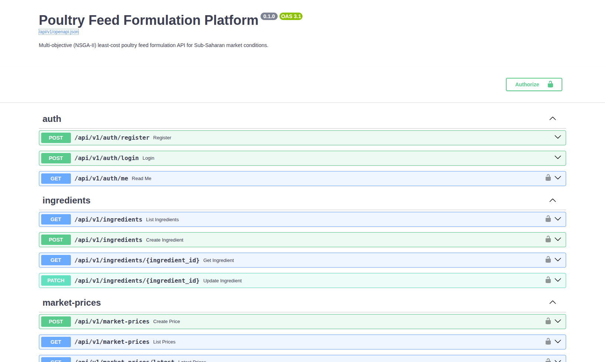

# Backend

## Dynamic Feed Formulation API

This directory contains the Python backend code for the dynamic feed formulation system. The backend exposes a REST API built using FastAPI, interacts with a PostgreSQL database, runs the machine learning forecasting models, and executes the optimization solvers.

## Technology Stack

*   **API Framework**: FastAPI (running asynchronously on Uvicorn)
*   **Database ORM**: SQLAlchemy 2.0 (Async extension) with Alembic for schema migrations
*   **Data Store**: PostgreSQL 16
*   **Machine Learning**: Scikit-learn (GradientBoostingRegressor), Pandas, NumPy
*   **Optimization Engines**: DEAP (Distributed Evolutionary Algorithms in Python) for NSGA-II, SciPy `linprog` (HiGHS solver) for the Linear Programming baseline

## Setup

### Docker (recommended)

```sh
cp backend/.env.example backend/.env
docker compose up --build
```

Seed the reference data once the stack is up:

```sh
alembic upgrade head
docker compose exec backend python -m app.db.seed_ingredients
docker compose exec backend python -m app.db.seed_price_history
```

### Local (python 3.12+)

```sh
cd backend
python -m venv .venv && source .venv/bin/activate
pip install -r requirements.txt

cp .env.example .env
# edit .env: POSTGRES_HOST/PORT/USER/PASSWORD/DB to match your Postgres,
# and set SECRET_KEY  (openssl rand -hex 32)

alembic upgrade head                  # initial schema
python -m app.db.seed_ingredients     # 12-ingredient library
python -m app.db.seed_price_history   # monthly WFP prices

uvicorn app.main:app --reload
```

Once the server (local or docker base) is running, the APIs can be accessed on:

API: [http://localhost:8000](http://localhost:8000)

Swagger UI: [http://localhost:8000/docs](http://localhost:8000/docs)

## Data Architecture & Seeding

The backend bundles raw price histories in `app/data/`:
*   `wfp_food_prices_rwa.csv`: Raw World Food Programme prices containing over 148,000 observations in Rwanda from 2000 to 2026.
*   `merged_feed_prices.csv`: The unified dataset containing 19,466 rows, integrating the historical monthly WFP commodity series with recent manual feed ingredient listings.

### Database Setup and Seeding
To run database migrations and seed the initial reference library and price history:

1.  **Run Alembic Migrations**:
    ```bash
    alembic upgrade head
    ```
2.  **Seed Core Ingredients**:
    ```bash
    python -m app.db.seed_ingredients
    ```
3.  **Seed Historical Price Records**:
    ```bash
    python -m app.db.seed_price_history
    ```

The seeder groups price history by year/month and stores it under either `"Rwanda"` (national average) or `"Province / District / Market"` (local retail/wholesale markets).

## API Endpoints

The API is deployed on [http://portstead.com:8000/docs](http://portstead.com:8000/docs)

Alternatively, the openapi specs are in file [openapi.json](../docs/openapi.json)

The API is versioned under `/api/v1` and exposes the following modules:

*   `/auth`: User registration, OAuth2 password flow login, and JWT session verification.
*   `/ingredients`: Reference library of 12 feed ingredients and their active statuses.
*   `/market-prices`: Latest observed prices per ingredient, manual price insertion, and unique location queries (`GET /market-prices/locations`).
*   `/flocks`: Flock metadata registry (broiler/layer, age, size, active formulation link).
*   `/forecasts`: Refresh forecast models (`POST /forecasts/refresh`), list predictions, run temporal backtesting (`GET /forecasts/backtest`), and query walk-forward formulation cost-savings backtests (`GET /forecasts/formulation-backtest`).
*   `/formulations`: Launch formulation optimization jobs (`POST /formulations/generate`), query job progress, view formulation history, and export rations to PDF or CSV.



## Test Suite

The repository includes standalone validation scripts and integration tests:

1.  **Optimization Core Validation**: Runs the DEAP NSGA-II and SciPy LP solvers against simulated prices to generate a Pareto front.
    ```bash
    PYTHONPATH=. python test_optimizer.py
    ```
2.  **API Smoke Test**: Simulates user registration, login, price entry, formulation, and export.
    ```bash
    PYTHONPATH=. python e2e_smoke.py
    ```
3.  **Forecasting Pipeline Test**: Validates the model refresh, prediction intervals, and walk-forward savings calculation.
    ```bash
    PYTHONPATH=. python forecast_e2e.py
    ```
